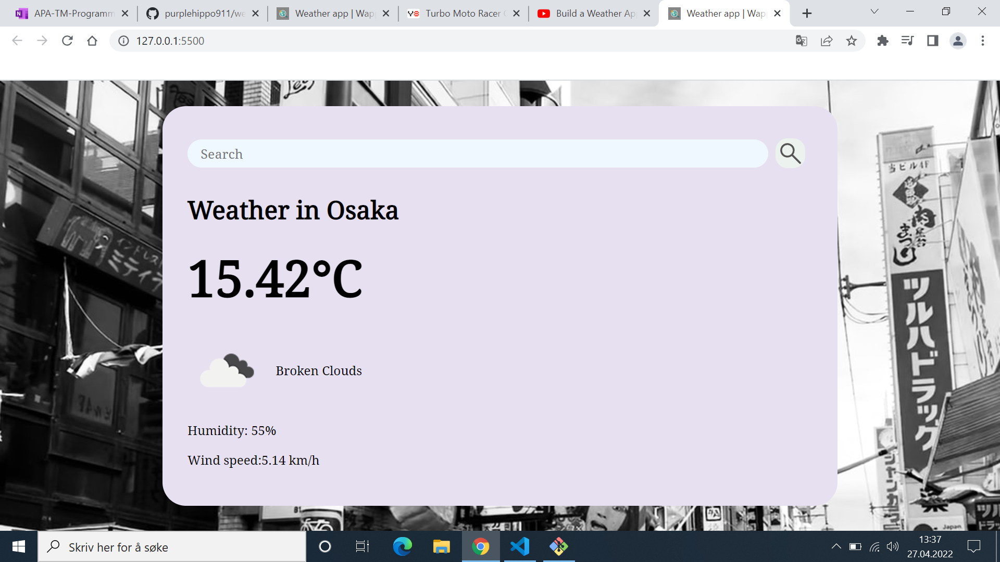
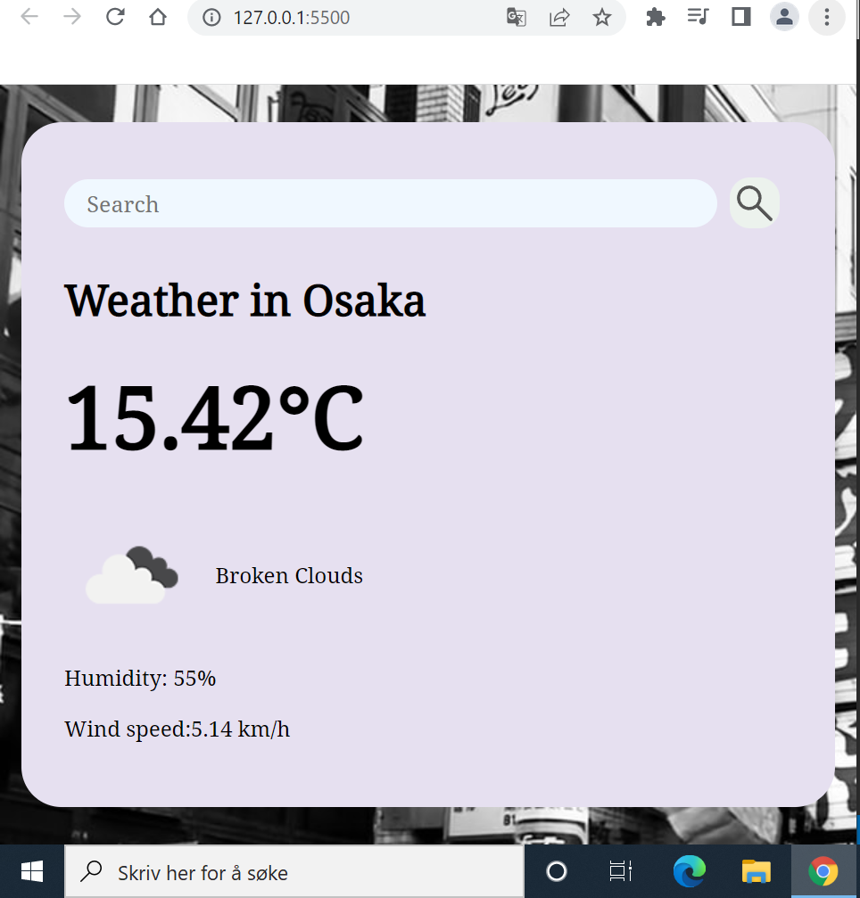

### Screenshots 
Desktop:

Mobile:

### Acknowledgment
Thanks to this tutorial which I followed along. Here's the turoial: [weatherapp tutorial](https://www.youtube.com/watch?v=WZNG8UomjSI)

### Author

Github: [purplehippo911](https://github.com/purplehippo911)